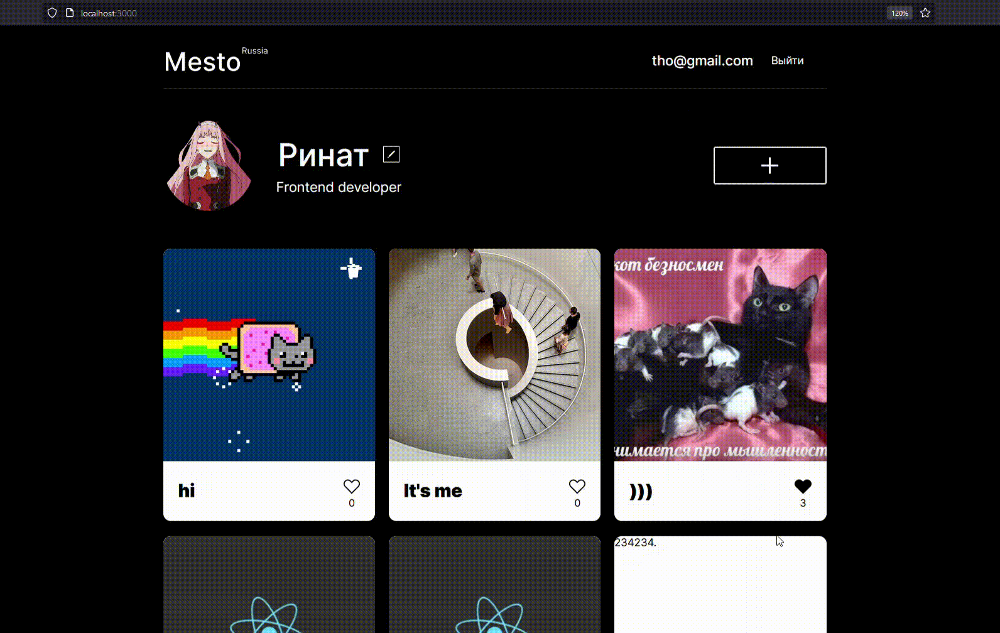

# Проект: Место *React*

  

*Проектная работа*  **Веб-приложения Место**: интерактивной страница, где можно,регистроировать и изменять свой профиль, добавить новые места, лайкать и удалять посты. Интуитивно понятный дизайн и приятный интерфейс.

***
### **Технологии**
* React
  * Кастомные хуки
  * Routing
  * HOC
  * Оптимизация приложения
  * Использование умных и глупых компонентов
* JavaScript
  * Валидация форм
* Адаптивная вёрстка
* REST Api

***

* [Ссылка на GitHub Pages](https://ri-yarm.github.io/mesto-react/)
***
### **Требования**

На вашем компьютере должны быть установлены Node.js и npm. Этот проект был построен на следующих версиях:

* Node v18.13.0
* npm v8.9.13

### **Установка**

* Клонируйте этот репозиторий на свой компьютер
* Перейдите в папку проекта и запустите `npm install react-scripts`
* Пропишите в консоли `npm start` и вы автоматически перейдёте по адресу `http://localhost:3000`
* Пропишите `npm run build` для сборки проекта
***